# Real-Time Web Chat Application

## Overview

This project is a comprehensive real-time web chat application designed to facilitate customer service interactions. It enables users to register, join a queue, engage in live chat with service desk agents, and allows administrators to manage customer data. The application incorporates real-time messaging, queue management with timeouts, and secure API endpoints for data retrieval.

The app is built to handle multiple modules including user authentication, chat sessions, queue rooms, and admin dashboards. It ensures a seamless experience for both customers and service desk personnel.

- Login: 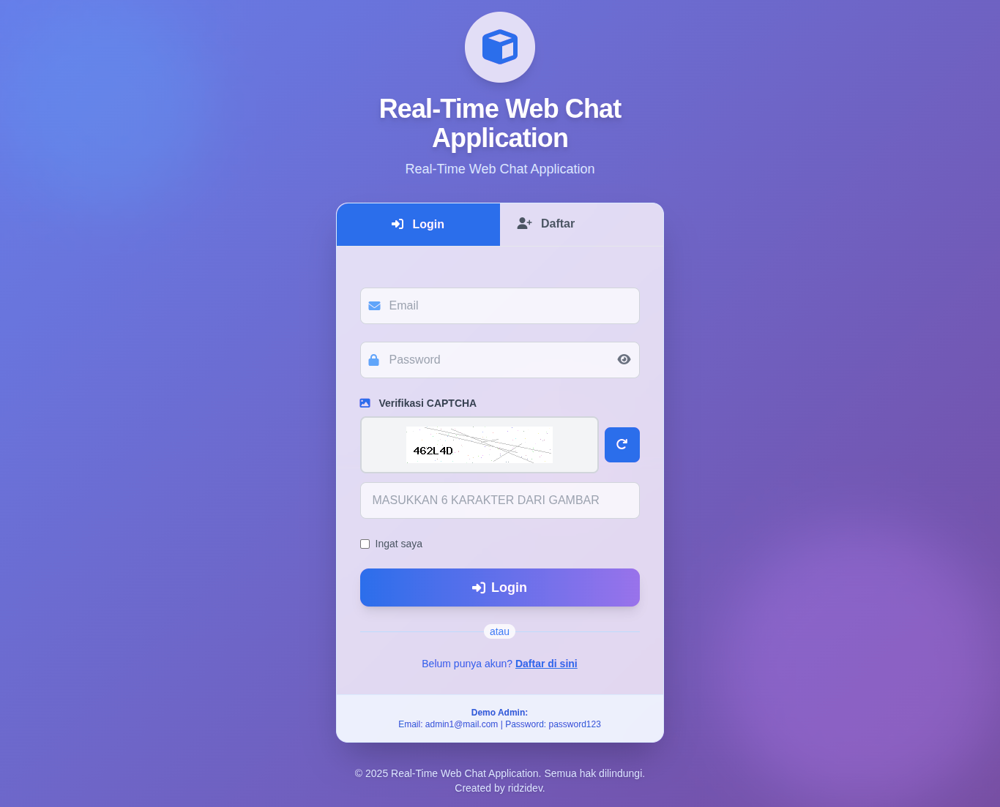
- register: 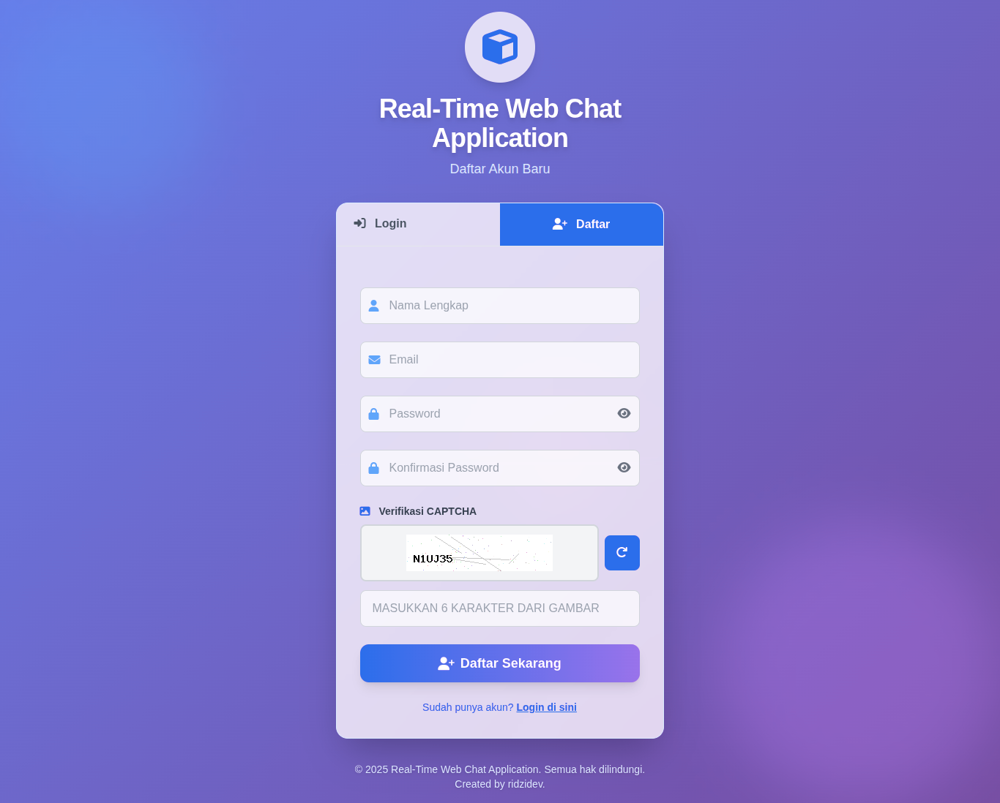
- Admin service-desk-dashboard: 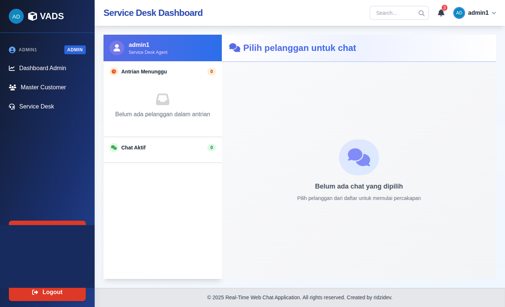
- Admin master-customers: 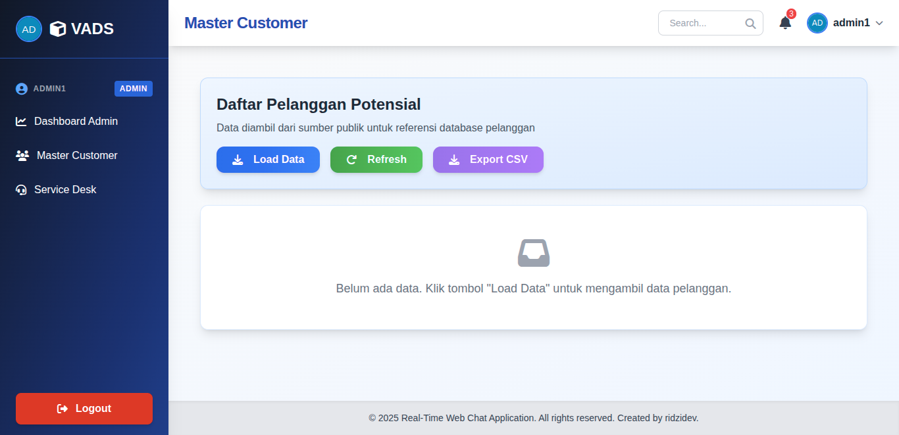
- Admin master-customers-load: 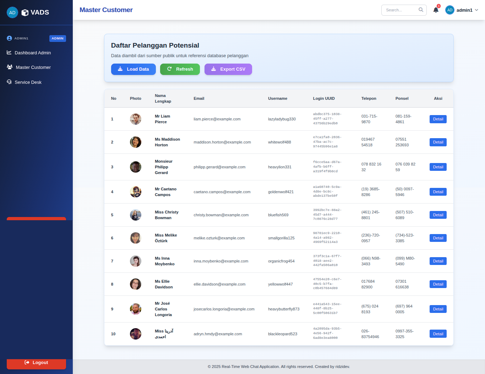
- Admin Dashboard: 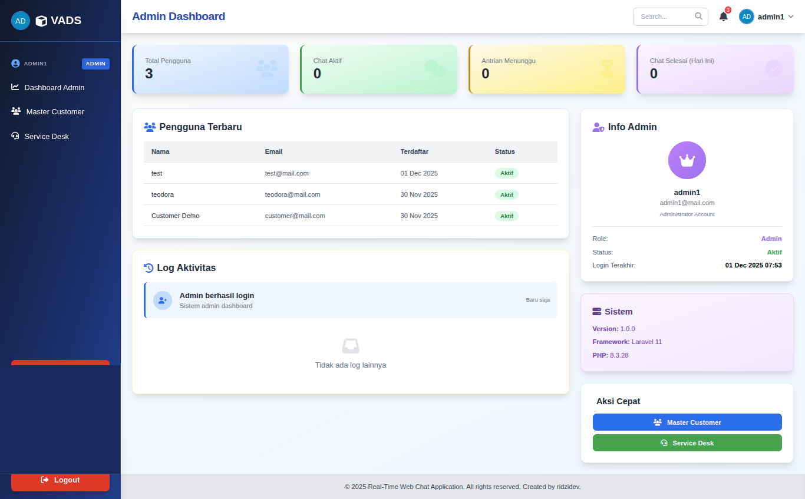

- Customers waiting : 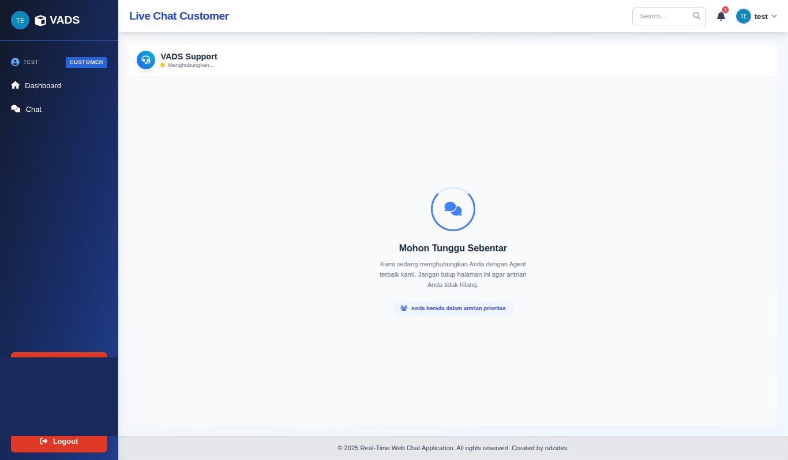
- admin pickup  : 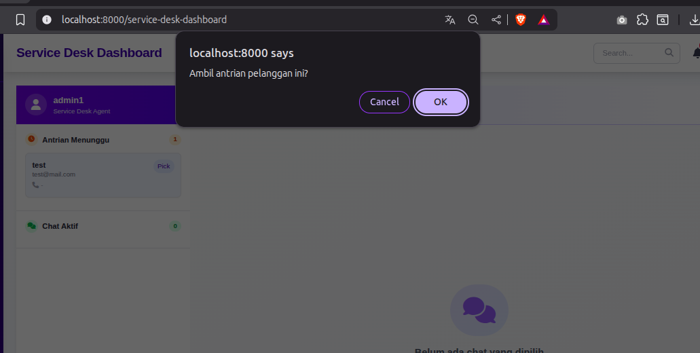
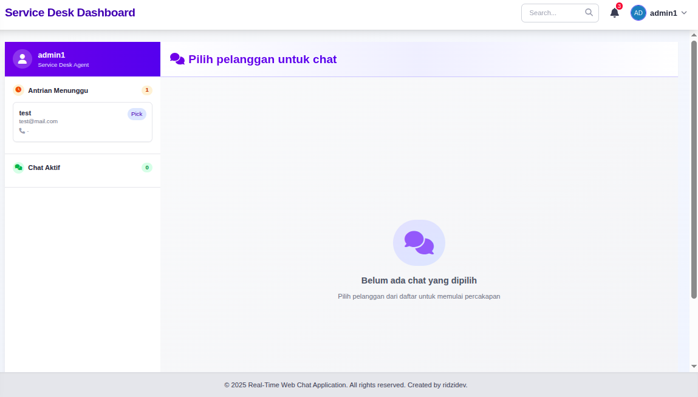
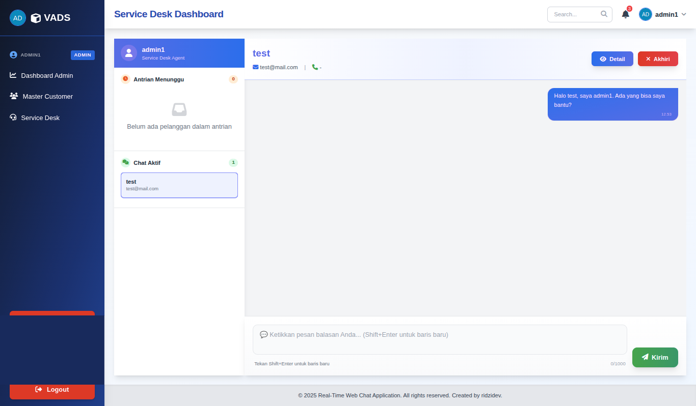

- Customers Chat : 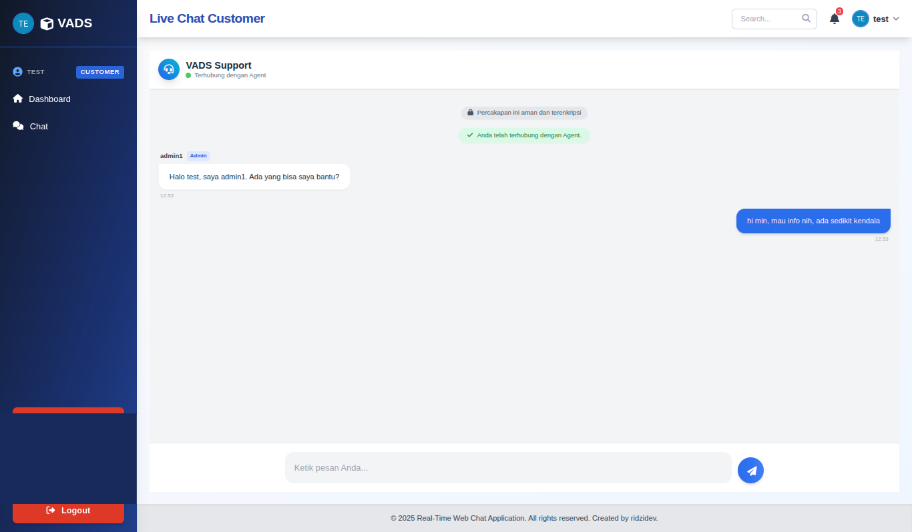


## Features

- **Live Chat**: Real-time chat functionality allowing customers to communicate with service desk agents.
- **User Registration**: Secure registration process with captcha validation.
- **Queue Management**: Automatic queue handling with timeout mechanisms (e.g., 3-minute wait periods).
- **Service Desk Dashboard**: Interface for agents to manage chats, view customer details, and access master customer data.
- **Admin Panel**: Includes master customer management with data manipulation from external APIs.
- **API Endpoints**: Secure POST endpoints for token generation and data retrieval with bearer authentication.
- **Auto-Reply System**: Automated responses for idle users and session management.

## Technologies Used

### Backend
- **PHP Framework**: Laravel (version 12.0) - Used for the main application logic, authentication, and API handling.
- **Node.js Framework**: Express.js with Socket.IO - Handles real-time communication for live chat.
- **Database**: MySQL or MariaDB - Stores user data, chat logs, and master items.
- **Authentication**: Laravel Sanctum for API token management.

### Frontend
- **JavaScript**: jQuery and AJAX for dynamic interactions.
- **HTML/CSS**: Bootstrap or Tailwind CSS for responsive design.
- **Real-Time Communication**: Socket.IO for client-server messaging.

### Other Tools
- **Composer**: Dependency management for PHP.
- **NPM**: Package management for Node.js and frontend assets.
- **PHPUnit**: For testing.

## Problems Breakdown

This README addresses the requirements for problems 1-5 as outlined in the project specifications.

### Problem 1: Build Web Chat Application

#### Design Workflow
1. User accesses landing page and logs in.
2. If not logged in, user registers with name, email, phone, and captcha.
3. User enters queue room; system searches for available service desk agents.
4. If agent found within 3 minutes, user connects to chat room.
5. If not, session closes automatically, redirecting to login.
6. In chat room, real-time messaging occurs with auto-replies for idle users.
7. Service desk agents manage chats from their dashboard.

#### Design Wireframe (Textual Description)
- **Landing Page / Login**: Form with email, password inputs; show/hide password toggle; validation for required fields and email format.
- **Landing Page / Live Chat ~> Session Register**: Inputs for name, email, phone, captcha; image captcha with refresh button; next button with validation.
- **Landing Page / Live Chat ~> Session Queue Room (< 3 min)**: Waiting screen while system searches for online agents.
- **Landing Page / Live Chat ~> Session Queue (> 3 min)**: Automatic session closure and redirect to login.
- **Landing Page / Live Chat ~> Connected to SD**: Chat interface with text area for messages; auto-replies for idle users.
- **Homepage Workspace Live Chat SD**: Dashboard showing customer data (name, email, phone, create date); chat history; buttons for send, view, sign out.
- **Homepage Workspace Live Chat SD ~> Menu Master Customer**: Table displaying manipulated customer data from API.

#### Functional Requirements
- **Login Page**: Email and password inputs with validation; show/hide password; required field checks.
- **Registration Page**: Name, email, phone, captcha inputs; random alphanumeric captcha; refresh captcha; validation for email format, required fields, and captcha match.
- **Queue Room**: 3-minute timer for agent search; auto-close if no agent found.
- **Chat Room**: Real-time messaging; auto-reply after 3 minutes idle ("Saya masih menunggu respons..."); close after 4 minutes ("Mohon maaf, chat diakhiri...").
- **Service Desk Dashboard**: Display customer info; send messages; view details; sign out.
- **Master Customer**: Fetch and manipulate JSON from https://randomuser.me/api?results=10&page=1; display in table.

### Problem 2: Master Customer Menu in Admin Panel

#### Wireframe
- Table layout displaying customer data: Name, Email, Login UUID, Username, Password, Phone, Cell, Picture.

#### Functional Requirements
- Fetch data from endpoint: https://randomuser.me/api?results=10&page=1.
- Manipulate JSON: Flatten name object to "title first last"; extract login fields (uuid, username, password); include phone, cell, picture.medium.
- Display manipulated data in a table on the service desk dashboard.

Example Manipulated Data:
```json
{
  "results": [
    {
      "name": "Miss Thea Green",
      "email": "thea.green@example.com",
      "login": {
        "uuid": "f31b9050-88af-4fbf-b144-3c3326a8d575",
        "username": "crazyduck828",
        "password": "dodgers1"
      },
      "phone": "(465)-834-3810",
      "cell": "(816)-225-7923",
      "picture": {
        "medium": "https://randomuser.me/api/portraits/med/women/17.jpg"
      }
    }
  ]
}
```

### Problem 3: SQL Script for Discounts

#### Variables
- discount_price_1 = 0.02
- discount_price_2 = 0.035
- discount_price_3 = 0.05

#### Tables
- **user**:
  | id | name              | email                      |
  |----|-------------------|----------------------------|
  | 1  | jonatan christie | jonatan.christie@test.com |
  | 2  | los blancos      | los.blancos@test.com      |
  | 3  | mawang           | mawang@test.com           |

- **master_items**:
  | id | id_name | items                  | estimate_price |
  |----|---------|------------------------|----------------|
  | 1  | 1       | Lampu bohlam LED 20 WATT | 20.000        |
  | 2  | 1       | Mouse wireless logitech | 175.000       |
  | 3  | 2       | Snack                   | 50.000        |
  | 4  | 2       | TV Plasma               | 2.500.000     |
  | 5  | 3       | Headphone               | 750.000       |
  | 6  | 3       | Lemari Besi             | 1.500.000     |

#### SQL Query
```sql
CREATE DATABASE IF NOT EXISTS db_skill_test;
USE db_skill_test;

DROP TABLE IF EXISTS master_items;
DROP TABLE IF EXISTS user;

CREATE TABLE user (
    id INT PRIMARY KEY AUTO_INCREMENT,
    name VARCHAR(255),
    email VARCHAR(255)
);

CREATE TABLE master_items (
    id INT PRIMARY KEY AUTO_INCREMENT,
    id_name INT,
    items VARCHAR(255),
    estimate_price DECIMAL(15, 2),
    FOREIGN KEY (id_name) REFERENCES user(id)
);

INSERT INTO user (id, name, email) VALUES
(1, 'jonatan christie', 'jonatan.christie@test.com'),
(2, 'los blancos', 'los.blancos@test.com'),
(3, 'mawang', 'mawang@test.com');

INSERT INTO master_items (id, id_name, items, estimate_price) VALUES
(1, 1, 'Lampu bohlam LED 20 WATT', 20000),
(2, 1, 'Mouse wireless logitech', 175000),
(3, 2, 'Snack', 50000),
(4, 2, 'TV Plasma', 2500000),
(5, 3, 'Headphone', 750000),
(6, 3, 'Lemari Besi', 1500000);

SET @discount_price_1 = 0.02;
SET @discount_price_2 = 0.035;
SET @discount_price_3 = 0.05;

SELECT 
    u.name, 
    m.items, 
    CAST(m.estimate_price AS DOUBLE) AS estimate_price,
    CAST(
        CASE 
            WHEN m.estimate_price < 50000 THEN @discount_price_1
            WHEN m.estimate_price >= 50000 AND m.estimate_price <= 1500000 THEN @discount_price_2
            WHEN m.estimate_price > 1500000 THEN @discount_price_3
        END 
    AS DOUBLE) AS `discount (%)`,
    CAST(
        (m.estimate_price - (m.estimate_price * CASE 
            WHEN m.estimate_price < 50000 THEN @discount_price_1
            WHEN m.estimate_price >= 50000 AND m.estimate_price <= 1500000 THEN @discount_price_2
            WHEN m.estimate_price > 1500000 THEN @discount_price_3
        END)) 
    AS DOUBLE) AS fix_price
FROM 
    master_items m
JOIN 
    user u ON m.id_name = u.id;
```

### Problem 4: API POST for Bearer Token

#### Endpoint
POST /api/token

#### Request Body
```json
{
  "name": "user_test",
  "date_request": "2025-11-25 17:02:00"
}
```

#### Response
```json
{
  "name": "user_test",
  "date_request": "2025-11-25 17:02:00",
  "token": "eyJhetc...",
  "exp": "1732534567"
}
```

#### Details
- Uses secretKey: Qw3rty09!@#
- Payload: ['exp' => '1 hour']
- 
### Problem 5: API POST with Bearer Token

#### Endpoint
POST /api/data

#### Request Body
```json
{
  "name_customers": "jonatan christie",
  "date_request": "2025-11-25 17:02:00"
}
```

#### Response
```json
{
  "result": [
    {
      "name_customers": "jonatan christie",
      "items": "Lampu bohlam LED 20 WATT",
      "discount": "0.02",
      "fix_price": "19600"
    },
    {
      "name_customers": "jonatan christie",
      "items": "Mouse wireless logitech",
      "discount": "0.035",
      "fix_price": "168875"
    }
  ]
}
```

#### Details
- Requires bearer token from Problem 4.
- Screenshot of response using Postman/SOAPUI: 

## Installation and Setup

1. Clone the repository.
2. Navigate to the backend directory: `cd backend`
3. Install PHP dependencies: `composer install`
4. Copy environment file: `cp .env.example .env`
5. Generate app key: `php artisan key:generate`
6. Run migrations: `php artisan migrate`
7. Install Node.js dependencies: `npm install`
8. Build assets: `npm run build`
9. Start the server: `php artisan serve`
10. For real-time server: Navigate to `realtime-server` and run `node index.js`

## Project Structure

- `backend/`: Laravel application
- `realtime-server/`: Node.js server for Socket.IO
- `docs/`: Documentation files
- `database/`: SQL dumps and migrations
- `images/`: Screenshots and images

## Contributing

Please upload full source code to a public GitHub repository. Include package.json, package-lock.json, and SQL dumps. Do not include .gitignore in the upload.

## License

MIT License
